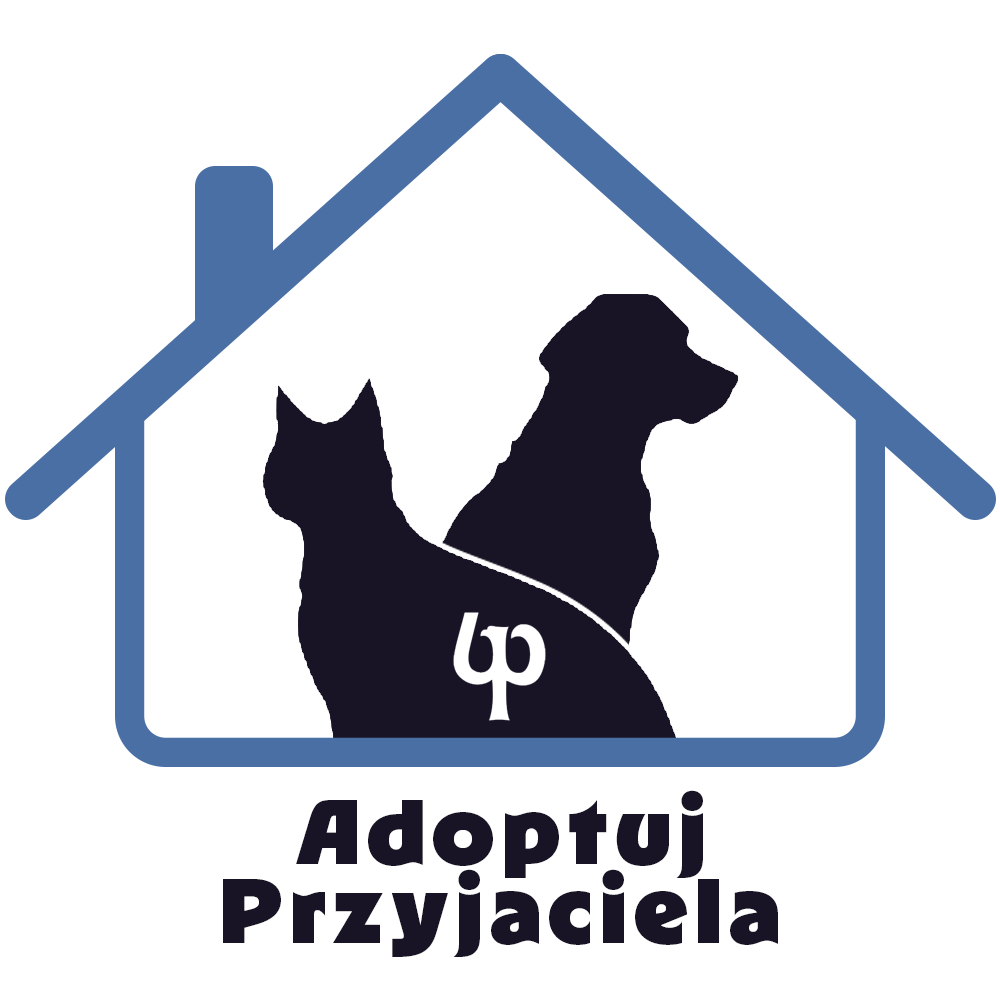

# Adoptuj Przyjaciela - Katalog Zwierząt do Adopcji

## 🚀 Demo

[Zobacz działającą wersję projektu](https://twój-link-do-demo.com)

## 📌 Opis projektu

Portal umożliwiający przeglądanie i adopcję zwierząt ze schronisk. Projekt zawiera:

- Katalog zwierząt z filtrowaniem i sortowaniem
- Formularz adopcyjny z walidacją
- Tryb ciemny/jasny
- W pełni responsywny interfejs

## 🛠 Technologie

- **Frontend**:
  
  
  
  
- **Backend**:
  
